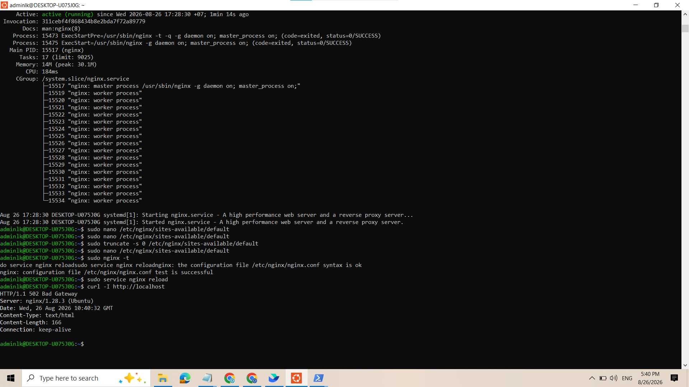
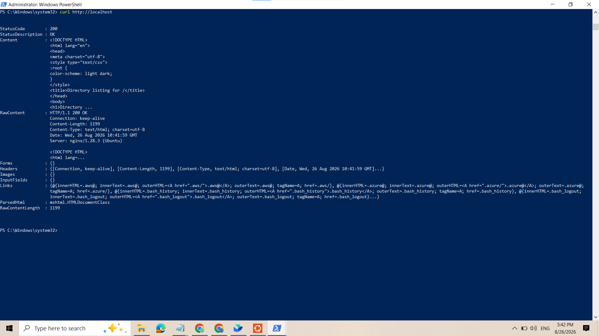

1. Cấu Hình Nginx Reverse Proxy Cơ Bản

Bước 1: Cài đặt và kích hoạt Nginx trên Ubuntu (WSL/VPS)

1. Mở terminal Ubuntu và chạy các lệnh sau để cài đặt Nginx:

sudo apt update && sudo apt install -y nginx

 
2. Khởi động dịch vụ Nginx:

sudo service nginx start

3. Kiểm tra trạng thái Nginx đang chạy (active (running)):

sudo service nginx status

Bước 2: Cấu hình Nginx Reverse Proxy

1. Mở file cấu hình mặc định của Nginx:

sudo nano /etc/nginx/sites-available/default

2. Xóa toàn bộ nội dung cũ (nhấn Ctrl + K để xóa nhanh từng dòng) và dán nội dung cấu hình chuẩn bên dưới vào:Nginxserver {
    listen 80 default_server;
    listen [::]:80 default_server;

    server_name _;

    location / {
        proxy_pass http://localhost:3000;
        proxy_set_header Host $host;
        proxy_set_header X-Real-IP $remote_addr;
        proxy_set_header X-Forwarded-For $proxy_add_x_forwarded_for;
        proxy_set_header X-Forwarded-Proto $scheme;
    }
}
Nhấn Ctrl + O -> bấm Enter để lưu file, sau đó nhấn Ctrl + X để thoát khỏi nano.

3. Kiểm tra cú pháp và áp dụng cấu hình mới:

sudo nginx -t
sudo service nginx reload

Bước 3: Kiểm thử và chụp 2 ảnh bằng chứng
Trường hợp 1: Khi ứng dụng cổng 3000 chưa chạy (Ứng dụng bị sập)

Chạy lệnh kiểm tra phản hồi từ cổng 80:

curl -I http://localhost
Màn hình sẽ hiển thị HTTP/1.1 502 Bad Gateway.

### 🖼️ Ảnh 1: Ứng dụng React sập, Nginx trả về lỗi 502

Trường hợp 2: Giả lập ứng dụng cổng 3000 đang hoạt động

Chạy lệnh tạo một server HTTP giả lập tại cổng 3000 trên Ubuntu:

python3 -m http.server 3000

Mở một cửa sổ Windows PowerShell (hoặc tab terminal khác) và gõ:

curl http://localhost

Màn hình sẽ phản hồi mã 200 OK và nội dung HTML thành công.

### 🖼️ Ảnh 2: Truy cập thành công qua Reverse Proxy

Quay lại tab Ubuntu đang chạy Python, nhấn Ctrl + C để tắt server giả lập.

2. Giải Thích Lý Thuyết & Đáp Án

Ý nghĩa chỉ thị proxy_pass: Hướng dẫn Nginx nhận tất cả yêu cầu HTTP gửi đến cổng 80 và chuyển tiếp (forward) dữ liệu tới ứng dụng backend đang chạy ở http://localhost:3000. Nginx đóng vai trò là Reverse Proxy trung gian tiếp nhận request và trả phản hồi về cho client.

Đáp án câu hỏi bẫy (Khi port 3000 bị sập): Nginx sẽ trả về mã lỗi HTTP 502 Bad Gateway. Nguyên nhân do Nginx (Proxy) tiếp nhận thành công request ở cổng 80 nhưng không thể kết nối tới Upstream Server (localhost:3000) do ứng dụng ở cổng 3000 bị tắt hoặc chối kết nối.

